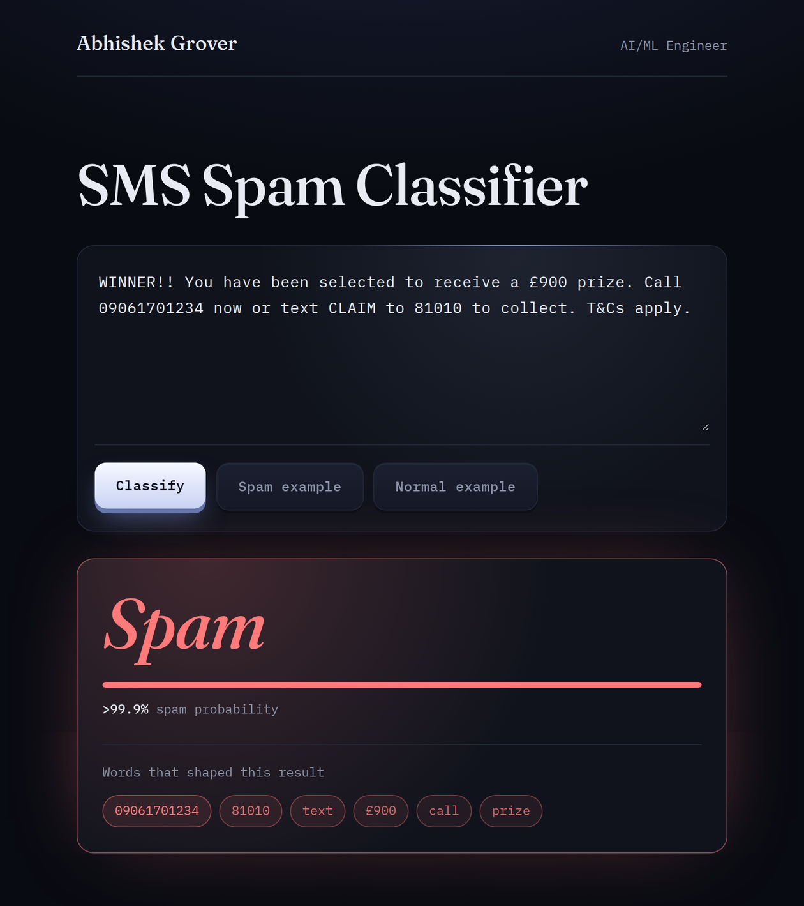
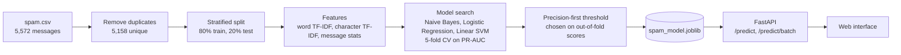

<div align="center">


<br>



</div>

## Table of contents

- [Overview](#overview)
- [Results](#results)
- [How it works](#how-it-works)
- [Dataset](#dataset)
- [API](#api)
- [Project structure](#project-structure)
- [Run locally](#run-locally)
- [Deployment](#deployment)
- [Author](#author)
- [License](#license)

## Overview

SMS Spam Classifier takes a raw text message and returns a spam probability, a verdict, and the words that drove the decision.

A scikit-learn pipeline combines word and character TF-IDF with a few message statistics. Three model families compete under stratified cross-validation, and the decision threshold is tuned so the filter flags as few real messages as possible. FastAPI serves the model and a minimal dark interface from one service, and `render.yaml` deploys it to Render.

## Results

Scored once on a stratified 20% hold-out (1,032 unique messages, 128 of them spam). Duplicates are removed before the split, and the threshold is chosen on training data only.

| Metric | Score |
| --- | --- |
| Precision | 1.000 |
| Recall | 0.969 |
| F1 | 0.984 |
| ROC-AUC | 0.999 |
| PR-AUC | 0.995 |

| | Predicted not spam | Predicted spam |
| --- | --- | --- |
| **Actually not spam** | 904 | 0 |
| **Actually spam** | 4 | 124 |

Always answering "not spam" already scores 87.6% accuracy on this data, so spam precision and recall are the numbers that matter. With 128 spam messages in the test split, one message moves recall by about 0.8 points, so treat the third decimal as noise.

| Model | CV PR-AUC | Test PR-AUC | Test ROC-AUC |
| --- | --- | --- | --- |
| Multinomial Naive Bayes | 0.9818 | 0.9847 | 0.9957 |
| Logistic Regression | 0.9845 | 0.9961 | 0.9993 |
| Linear SVM (calibrated) | **0.9852** | 0.9951 | 0.9989 |

The Linear SVM was picked on cross-validated PR-AUC, never on the test split. The three models land within noise of each other, which is typical for this dataset.

## How it works



| Decision | Why |
| --- | --- |
| Duplicates removed before splitting | The same text in train and test inflates scores (414 rows dropped) |
| Numbers become shapes: phone number, short code, amount, link | Spammers rarely repeat the exact number, but the shape repeats constantly |
| Word and character n-grams | Characters catch txt-speak and misspellings that words miss |
| Threshold set for at least 98% precision on out-of-fold predictions | Blocking a real message costs more than missing a spam |
| Leave-one-word-out explanations | Needs only probabilities, so it works with any model in the pipeline |
| Fixed seeds, retrain on deploy | Reproducible scores, and the model always matches the installed scikit-learn |

## Dataset

SMS Spam Collection by Tiago A. Almeida and José María Gómez Hidalgo, from the [UCI Machine Learning Repository](https://archive.ics.uci.edu/dataset/228/sms+spam+collection) (CC BY 4.0).

`data/spam.csv` holds 5,572 labelled messages: 4,825 normal and 747 spam. After exact duplicates are removed, 5,158 remain (4,516 normal, 642 spam). That is the data the model trains and is tested on.

## API

| Method | Path | Purpose |
| --- | --- | --- |
| GET | `/` | Web interface |
| GET | `/health` | Liveness check |
| GET | `/model` | Active model, threshold and test metrics |
| POST | `/predict` | Classify one message and explain it |
| POST | `/predict/batch` | Classify up to 100 messages |
| GET | `/docs` | Interactive API reference |

```bash
curl -X POST http://localhost:8000/predict \
  -H "Content-Type: application/json" \
  -d '{"message": "WINNER!! You have been selected to receive a £900 prize. Call 09061701234 now."}'
```

```json
{
  "label": "spam",
  "spam_probability": 0.9997,
  "threshold": 0.5324,
  "signals": [
    { "word": "09061701234", "weight": 5.44 },
    { "word": "£900", "weight": 1.16 },
    { "word": "call", "weight": 0.86 },
    { "word": "prize", "weight": 0.68 }
  ]
}
```

`signals` lists the words that pushed the score toward the predicted label, strongest first (shortened here).

## Project structure

```text
sms-spam-classifier/
├── app/
│   ├── main.py            FastAPI app and routes
│   └── schemas.py         request and response models
├── src/
│   ├── config.py          paths and constants
│   ├── features.py        text normalisation and feature building
│   ├── train.py           cleaning, model search, threshold, metrics
│   └── predictor.py       model loading, predictions, explanations
├── static/
│   ├── index.html
│   ├── style.css
│   ├── script.js
│   └── fonts/             Fraunces and IBM Plex Mono (SIL OFL)
├── data/spam.csv
├── models/
│   ├── spam_model.joblib
│   └── metrics.json
├── tests/
├── docs/preview.png
├── render.yaml
├── requirements.txt
├── requirements-dev.txt
├── pytest.ini
├── .python-version
├── LICENSE
└── README.md
```

## Run locally

```bash
git clone https://github.com/AbhishekGrover1/sms-spam-classifier.git
cd sms-spam-classifier

python -m venv .venv
source .venv/bin/activate        # Windows: .venv\Scripts\activate
pip install -r requirements.txt

uvicorn app.main:app --reload
```

Open `http://localhost:8000` for the interface or `http://localhost:8000/docs` for the API reference.

Retrain the model (about 40 seconds) with `python -m src.train`. If `models/spam_model.joblib` is missing or was saved by a different scikit-learn version, the app retrains on startup.

Run the tests with `pip install -r requirements-dev.txt` and then `pytest`.

## Deployment

`render.yaml` describes a free Render web service. The build step installs the dependencies and retrains the model, `/health` is the health check, and the service starts with uvicorn.

## Author

<div align="center">

**Abhishek Grover**, AI/ML Engineer

[](https://github.com/AbhishekGrover1)
[](https://www.linkedin.com/in/abhishek-grover-07)
[](https://abhishekgroverai.netlify.app)

</div>

## License

The code is released under the [MIT License](LICENSE). The dataset keeps its own CC BY 4.0 license, and the bundled fonts are under the SIL Open Font License.


